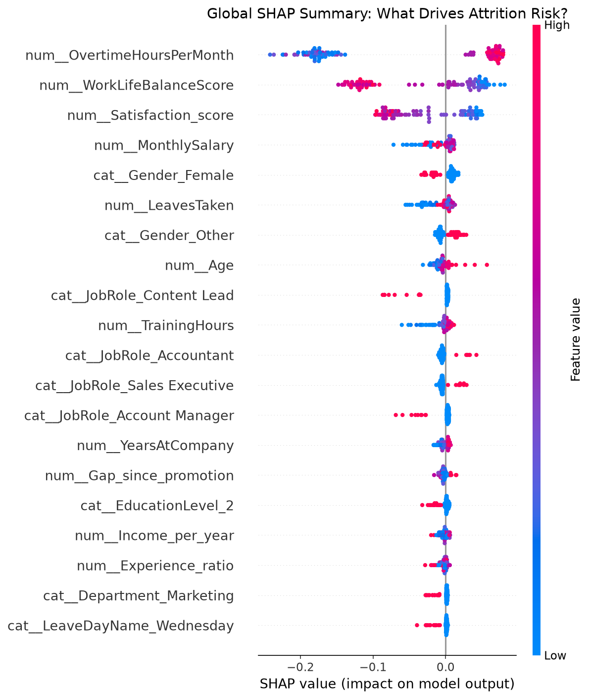
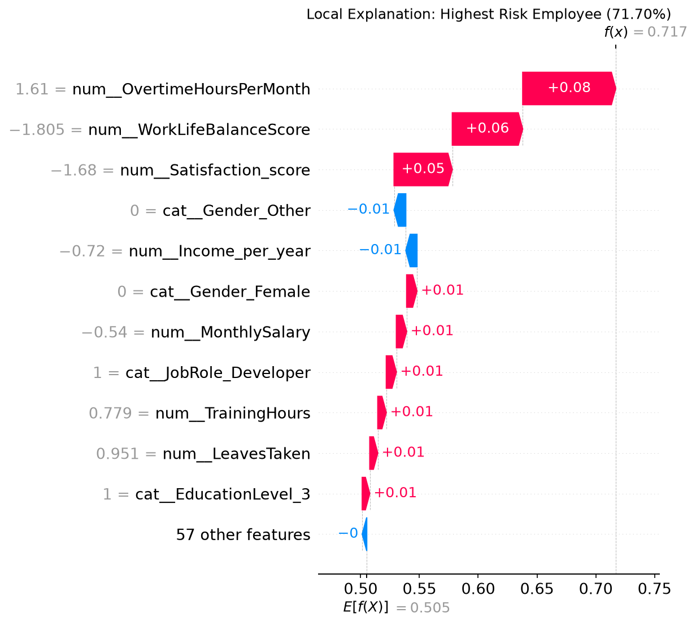
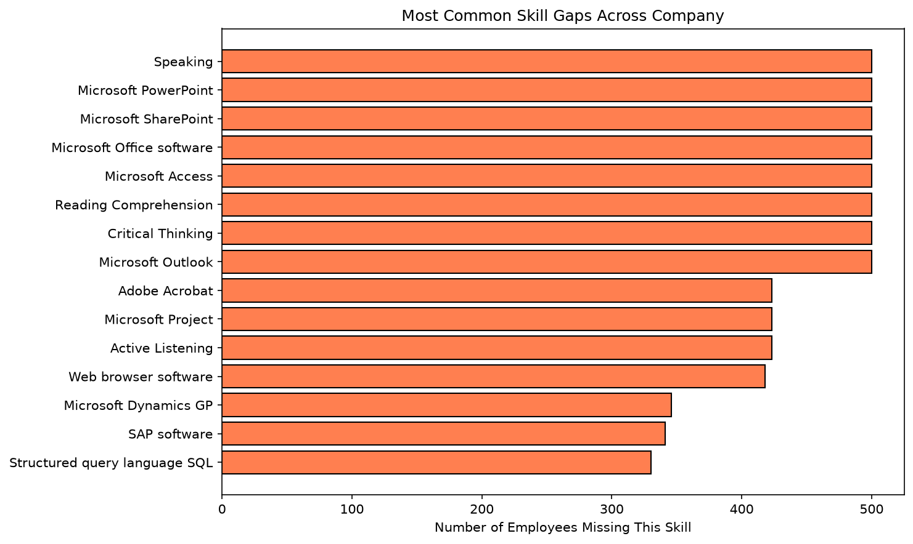
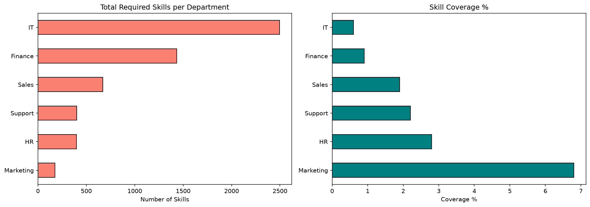
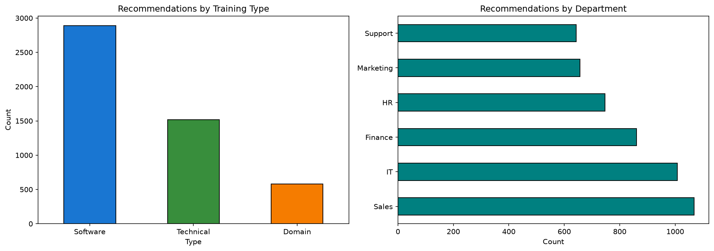

<div align="center">

# 🧠 Enterprise HR AI Platform

### Predictive Attrition Intelligence · Skill Gap Analysis · Workforce Optimization

[](https://python.org)
[](https://fastapi.tiangolo.com)
[](https://streamlit.io)
[](https://scikit-learn.org)
[](LICENSE)

---

**An end-to-end machine learning platform that predicts employee attrition risk, identifies organizational skill gaps, and generates personalized upskilling recommendations — powered by 16 analysis notebooks, a production REST API, and an interactive dashboard.**

</div>

---

## 📊 Live Demo

| Dashboard | API | Notebooks |
|-----------|-----|-----------|
| [](#) | [](#) | [](#) |

---

## 🏗️ Architecture

```
┌─────────────────────────────────────────────────────────────────┐
│                         USER INTERFACE                          │
├─────────────────────────┬───────────────────────────────────────┤
│   📊 Streamlit UI       │          📡 FastAPI Backend            │
│   (dashboard.py)        │          (app/main.py)                │
│                         │                                       │
│   • KPI Cards           │   POST /predict/attrition             │
│   • Risk Distribution   │   GET  /dashboard/summary             │
│   • Department Analysis │   GET  /dashboard/attrition-by-dept   │
│   • Skill Gap Charts    │   GET  /dashboard/skill-gaps          │
│   • Employee Drill-Down │   GET  /dashboard/recommendations     │
│                         │   GET  /employees/{id}                │
├─────────────────────────┴───────────────────────────────────────┤
│                      ML CORE ENGINE                             │
├───────────────────┬───────────────────┬─────────────────────────┤
│  🎯 Prediction    │  🔍 Skill Gap     │  📚 Recommendations     │
│  Engine           │  Engine           │  Engine                 │
│                   │                   │                         │
│  • Random Forest  │  • O*NET Mapping  │  • 500+ Course Catalog  │
│  • XGBoost        │  • Department     │  • Fuzzy Matching       │
│  • SHAP Explain   │    Aggregation    │  • Priority Scoring     │
│  • Feature Eng.   │  • Coverage %     │  • Duration Tracking    │
├───────────────────┴───────────────────┴─────────────────────────┤
│                   DATA PROCESSING LAYER                         │
├─────────────────────────────────────────────────────────────────┤
│  📁 data/raw/ → 🧹 Cleaning → 🔧 Features → 🤖 Models         │
│                                                                 │
│  • 500 Employees · 24 Features · 6 Departments                  │
│  • 3,150 Engagement Records · 18,200 Skill Records              │
│  • O*NET Occupation & Skills Database                            │
├─────────────────────────────────────────────────────────────────┤
│                   MONITORING & LOGGING                           │
├─────────────────────────────────────────────────────────────────┤
│  📝 Prediction Logs · 📈 Model Versioning · 🔐 Audit Trail      │
└─────────────────────────────────────────────────────────────────┘
```

---

## 📁 Project Structure

```
enterprise_hr_ai/
│
├── 📊 dashboard.py                    # Streamlit dashboard entry point
├── 📋 requirements.txt                # Python dependencies
├── 📖 README.md                       # This file
│
├── 📓 notebooks/                      # 16 Analysis Notebooks
│   ├── 01_data_understanding.ipynb    #   Exploratory data analysis
│   ├── 02_data_validation.ipynb       #   Data quality checks
│   ├── 03_data_cleaning.ipynb         #   Preprocessing pipeline
│   ├── 04_data_relationships.ipynb    #   Correlation analysis
│   ├── 05_feature_engineering.ipynb   #   Feature creation & selection
│   ├── 06_baseline_model.ipynb        #   Logistic Regression baseline
│   ├── 07_model_comparison.ipynb      #   RF vs XGBoost vs SVM
│   ├── 08_model_explainability.ipynb  #   SHAP values & insights
│   ├── 09_model_versioning.ipynb      #   Model registry & versioning
│   ├── 10_engagement_intelligence.ipynb # Engagement analysis
│   ├── 11_role_intelligence.ipynb     #   Role-skill mapping
│   ├── 12_employee_skills.ipynb       #   Individual skill profiles
│   ├── 13_skill_gap_engine.ipynb      #   Gap detection logic
│   ├── 14_organization_skill_gap.ipynb # Org-wide gap analysis
│   ├── 15_recommendation_engine.ipynb #   Training recommendations
│   └── 16_employee_intelligence.ipynb #   Unified intelligence table
│
├── 🐍 app/                            # FastAPI Application
│   ├── main.py                        #   App entry point
│   ├── api/
│   │   ├── endpoints.py               #   Route handlers
│   │   └── schemas.py                 #   Pydantic models
│   ├── ml/
│   │   ├── model_loader.py            #   Pipeline loader
│   │   ├── predictor.py               #   Prediction logic
│   │   └── prediction_logger.py       #   JSONL logging
│   ├── services/
│   │   ├── skill_gap_service.py       #   Gap computation
│   │   └── recommendation_service.py  #   Recommendation engine
│   └── utils/
│       ├── config.py                  #   Path configuration
│       └── logger.py                  #   Structured logging
│
├── 📁 data/
│   ├── raw/                           # Source datasets (5 CSVs)
│   │   ├── employee_attrition.csv     #   500 employees × 24 features
│   │   ├── hr_performance_engagement.csv # 3,150 engagement records
│   │   ├── occupation_data.csv        #   O*NET occupation roles
│   │   ├── essential_skills.csv       #   18,200 skill records
│   │   └── software_skills.csv        #   31,821 software skills
│   ├── processed/                     # Cleaned & engineered data
│   └── features/                      # ML-ready features
│
├── 🤖 models/                         # Trained Models
│   ├── attrition_pipeline.joblib      #   Production pipeline
│   └── v1/                            #   Versioned snapshot
│
├── 🧪 tests/                          # Test Suite (70 tests)
│   ├── test_api.py                    #   API endpoint tests
│   ├── test_predictor.py              #   Prediction logic tests
│   ├── test_skill_gap.py              #   Skill gap tests
│   └── test_validation.py             #   Input validation tests
│
└── 📁 docs/                           # Generated Visualizations
    ├── shap_*.png                     #   Model explainability
    ├── engagement_*.png               #   Engagement insights
    ├── skill_*.png                    #   Skill gap charts
    └── training_*.png                 #   Recommendation charts
```

---

## 🎯 Key Features

| Feature | Description | Status |
|---------|-------------|--------|
| **Attrition Prediction** | Random Forest model (ROC-AUC: 0.79) predicting employee flight risk | ✅ |
| **SHAP Explainability** | Individual prediction explanations with waterfall & dependence plots | ✅ |
| **Skill Gap Detection** | O*NET-powered gap analysis across 6 departments | ✅ |
| **Smart Recommendations** | 500+ course catalog with fuzzy matching to O*NET skill names | ✅ |
| **Employee Drill-Down** | Per-employee risk, gaps, and personalized training plans | ✅ |
| **REST API** | FastAPI with Pydantic validation, prediction logging, CORS | ✅ |
| **Interactive Dashboard** | Plotly visualizations, KPI cards, department filters | ✅ |
| **Model Versioning** | Version snapshots with metadata & metrics tracking | ✅ |
| **Prediction Logging** | Daily JSONL logs with timestamps, probabilities, risk levels | ✅ |
| **Unit Tests** | 70 passing tests across API, predictor, validation, skill gap | ✅ |

---

## 🚀 Quick Start

### Prerequisites
- Python 3.11+
- pip or conda

### Installation

```bash
# Clone the repository
git clone https://github.com/aggarwalmoksh/enterprise_hr_ai.git
cd enterprise_hr_ai

# Create virtual environment
python -m venv .venv
source .venv/bin/activate  # On Windows: .venv\Scripts\activate

# Install dependencies
pip install -r requirements.txt

# Run notebooks (optional - generates processed data)
jupyter notebook notebooks/
```

### Run the Dashboard

```bash
streamlit run dashboard.py
```

### Run the API

```bash
uvicorn app.main:app --reload --host 0.0.0.0 --port 8000
```

### Run Tests

```bash
pytest tests/ -v
```

---

## 📡 API Endpoints

| Method | Endpoint | Description |
|--------|----------|-------------|
| `POST` | `/predict/attrition` | Predict attrition risk for an employee |
| `GET` | `/dashboard/summary` | KPI summary (total, high-risk, avg engagement) |
| `GET` | `/dashboard/attrition-by-department` | Attrition risk breakdown by department |
| `GET` | `/dashboard/skill-gaps` | Organizational skill gap analysis |
| `GET` | `/dashboard/recommendations` | Top training recommendations |
| `GET` | `/employees/{id}` | Individual employee intelligence |

### Example Request

```bash
curl -X POST "http://localhost:8000/predict/attrition" \
  -H "Content-Type: application/json" \
  -d '{
    "Age": 35,
    "Department": "Sales",
    "JobRole": "Sales Executive",
    "Gender": "Male",
    "MonthlySalary": 5500,
    "YearsAtCompany": 5,
    "JobSatisfaction": 3,
    "WorkLifeBalance": 3,
    "OvertimeHoursPerMonth": 10,
    "PerformanceRating": 3,
    "CustomerSatisfaction": 4,
    "EducationLevel": "Bachelor"
  }'
```

---

## 📈 Model Performance

| Model | ROC-AUC | Accuracy | Precision | Recall | F1 |
|-------|---------|----------|-----------|--------|----|
| **Random Forest** | **0.794** | **0.89** | **0.52** | **0.28** | **0.36** |
| XGBoost | 0.761 | 0.89 | 0.48 | 0.25 | 0.33 |
| Logistic Regression | 0.737 | 0.88 | 0.42 | 0.22 | 0.29 |
| SVM | 0.726 | 0.88 | 0.40 | 0.20 | 0.27 |

> **Note:** Class imbalance (89/11 split) makes precision/recall challenging. The model excels at identifying high-risk employees for proactive intervention.

---

## 📊 Dataset Overview

| Dataset | Records | Features | Description |
|---------|---------|----------|-------------|
| Employee Attrition | 500 | 24 | Core employee demographics & metrics |
| HR Performance | 3,150 | 39 | Engagement scores & satisfaction |
| Occupation Data | 1,016 | 3 | O*NET role classifications |
| Essential Skills | 18,200 | 15 | Role-skill requirements |
| Software Skills | 31,821 | 7 | Software proficiency mapping |

---

## 🔧 Tech Stack

<div align="center">

| Category | Technologies |
|----------|-------------|
| **ML/AI** | scikit-learn, XGBoost, SHAP, joblib |
| **Backend** | FastAPI, Pydantic, uvicorn |
| **Frontend** | Streamlit, Plotly |
| **Data** | pandas, NumPy |
| **Testing** | pytest, FastAPI TestClient |
| **Logging** | Python logging, JSONL |

</div>

---

## 📝 Development Workflow

```
Week 1: Data Pipeline
├── 01-04: Understanding → Validation → Cleaning → Relationships
└── 05: Feature Engineering (42 features → 18 selected)

Week 2: Model Development
├── 06-07: Baseline → Model Comparison (RF wins)
├── 08: SHAP Explainability
└── 09: Model Versioning & Registry

Week 3: Intelligence Layer
├── 10-11: Engagement & Role Intelligence
├── 12-14: Skills → Gaps → Organization Analysis
└── 15-16: Recommendations → Unified Intelligence Table

Week 4: Production
├── FastAPI Backend with validation & logging
├── Streamlit Dashboard with interactive charts
├── 70 Unit Tests across all modules
└── GitHub deployment
```

---

## 🧪 Running Tests

```bash
# Run all tests
pytest tests/ -v

# Run specific test file
pytest tests/test_api.py -v

# Run with coverage
pytest tests/ --cov=app --cov-report=html
```

---

## 📸 Visualizations

<details>
<summary><b>SHAP Model Explainability</b></summary>




</details>

<details>
<summary><b>Skill Gap Analysis</b></summary>




</details>

<details>
<summary><b>Training Recommendations</b></summary>



</details>

---

## 🤝 Contributing

1. Fork the repository
2. Create your feature branch (`git checkout -b feature/amazing-feature`)
3. Commit your changes (`git commit -m 'Add amazing feature'`)
4. Push to the branch (`git push origin feature/amazing-feature`)
5. Open a Pull Request

---

## 📄 License

This project is licensed under the MIT License - see the [LICENSE](LICENSE) file for details.

---

## 🙏 Acknowledgments

- [O*NET](https://www.onetonline.org/) - Occupational skill database
- [SHAP](https://github.com/shap/shap) - Model explainability
- [Streamlit](https://streamlit.io/) - Interactive dashboards
- [FastAPI](https://fastapi.tiangolo.com/) - Modern Python APIs

---

<div align="center">

**Built with ❤️ for Enterprise HR Intelligence**

[⬆ Back to Top](#-enterprise-hr-ai-platform)

</div>
